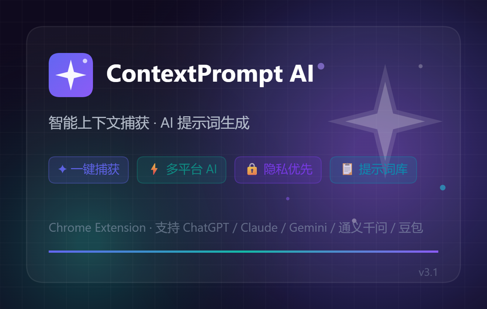

<div align="center">



# ContextOS

**Your browser is sitting on a goldmine of context. ContextOS mines it.**

Capture web pages, build a personal knowledge graph with semantic search,
and inject the right context into any AI conversation — all running locally in your browser.

[](./LICENSE)


English · [中文](./README.md)

</div>

---

## What It Does

ContextOS is a Chrome extension that turns your browsing into a structured, searchable knowledge base — and makes that knowledge available to any AI you talk to.

- **Capture** any web page in one click (or automatically by URL pattern)
- **Build** a knowledge graph with auto-discovered semantic relationships
- **Search** with hybrid vector + keyword retrieval (384-dim embeddings, BM25, RRF fusion)
- **Inject** assembled context into ChatGPT, Claude, Gemini, DeepSeek, and 8 more AI platforms
- **Expose** your knowledge to Claude Desktop / Cursor via MCP protocol

Everything runs local-first. AI features are optional and bring-your-own-key.

---

## Architecture

```
┌─────────────────────────────────────────────────────────┐
│  Content Scripts                                        │
│  ┌──────────┐  ┌──────────────────┐  ┌───────────────┐ │
│  │ Capture  │  │ Selection Toolbar│  │ AI Injector   │ │
│  │ 3 depths │  │ Save/Summarize/  │  │ 12 platforms  │ │
│  │          │  │ Translate/Copy   │  │ Craft Prompt  │ │
│  └────┬─────┘  └────────┬─────────┘  └───────┬───────┘ │
└───────┼────────────────┼──────────────────┼─────────────┘
        │                │                  │
        ▼                ▼                  ▼
┌─────────────────────────────────────────────────────────┐
│  Background Service Worker (Message Hub)                │
│  ┌──────────┐  ┌──────────┐  ┌────────────────────────┐│
│  │ AI Router│  │ Knowledge│  │ Context Orchestrator   ││
│  │ 3-level  │  │ Graph    │  │ Token budget + compress││
│  │ fallback │  │ CRUD     │  │                        ││
│  └──────────┘  └──────────┘  └────────────────────────┘│
└─────────────────────────────────────────────────────────┘
        │                │                  │
        ▼                ▼                  ▼
┌──────────────┐ ┌──────────────┐ ┌───────────────────┐
│ Dexie.js     │ │ Offscreen    │ │ Native Host       │
│ IndexedDB    │ │ Transformers │ │ MCP Bridge        │
│ 5 tables     │ │ .js Embeddings│ │ JSON-RPC 2.0     │
└──────────────┘ └──────────────┘ └───────────────────┘
```

---

## Features

### Knowledge Capture

| Feature | Detail |
|---------|--------|
| One-click capture | Title, URL, content, meta, Open Graph, JSON-LD |
| Three capture depths | Light (save tokens) · Standard · Deep (full content) |
| Batch capture | All open tabs in one click |
| AI chat extraction | ChatGPT, Claude, Gemini, DeepSeek, Qwen, Doubao, Poe, Perplexity, Copilot, HuggingChat, Mistral, Grok |
| Selection toolbar | Select text → floating bar → Save / AI Summarize / Translate / Copy as Markdown |
| Auto capture | URL pattern matching with notification |
| Keyboard shortcuts | `Ctrl+Shift+C` capture · `Ctrl+Shift+P` generate prompt |
| Right-click menu | Capture page / selection / link |

### Knowledge Graph

- Auto-tagging via NLP keyword extraction (TF-IDF scoring, EN + ZH stop words)
- Vector embeddings: all-MiniLM-L6-v2 (384-dim), computed in-browser via Transformers.js offscreen document
- Relationship discovery: semantic similarity, URL domain, tag overlap (Jaccard), temporal proximity
- D3.js force-directed graph visualization with interactive node selection and actions (view / delete)
- Hybrid search: vector similarity (60%) + BM25 keyword (40%), fused with Reciprocal Rank Fusion

### AI Integration

Three-level routing with automatic fallback:

| Level | Engine | When |
|-------|--------|------|
| 1 | Chrome Gemini Nano | Available, supported language (EN/ES/JA) |
| 2 | Cloud API | User-configured provider + API key |
| 3 | Rule-based NLP | Always available, no API needed |

Supported cloud providers:

| Provider | Example Models |
|----------|---------------|
| OpenAI | gpt-4o, gpt-4o-mini |
| Anthropic | Claude Sonnet, Claude Haiku |
| DeepSeek | deepseek-chat, deepseek-reasoner |
| Qwen | qwen-turbo, qwen-plus, qwen-max |
| Custom | Any OpenAI-compatible endpoint |

AI capabilities: summarization, translation, quality analysis, context fusion, prompt optimization.

### Context Orchestration

When you click "Craft Prompt" on an AI platform, ContextOS:

1. Searches the knowledge graph for relevant nodes
2. Includes current page context
3. Allocates a token budget per section (model-aware limits)
4. Compresses and formats into a structured context package
5. Shows a preview panel, then inserts into the AI chat input

### AI Platform Injection

The "Craft Prompt" button is injected into 12 AI platforms:

ChatGPT · Claude · Gemini · DeepSeek · Qwen · Doubao · Poe · Perplexity · Copilot · HuggingChat · Mistral · Grok

Shadow DOM isolation ensures zero style conflicts. Can be toggled off in settings.

### MCP Protocol

Expose your knowledge base to external AI tools via Native Messaging Host:

| Tool | Description |
|------|-------------|
| `search_knowledge` | Semantic search across the knowledge graph |
| `get_context` | Assemble a context package for a target model |
| `capture_page` | Capture the current browser tab |
| `list_knowledge` | List recent knowledge nodes |
| `get_stats` | Knowledge graph statistics |

### Workflow Engine

Predefined multi-step workflows:

- **Academic Research**: Capture → Summarize → Search Knowledge → Generate Context
- **Competitive Analysis**: Capture → Extract Features → Compare → Export Report
- **Code Review**: Capture → Analyze → Generate Review Prompt
- **Content Curation**: Capture → Summarize → Tag → Add to Knowledge

### UI

- **Popup**: Quick capture, context list, search, multi-select fusion, settings, history
- **Side Panel**: Knowledge browser, D3 graph visualization, workflow execution, settings
- **Onboarding**: Three-step guided tour for new users
- **Themes**: System / Light / Dark, synced across popup and side panel
- **i18n**: English + 中文, runtime switchable (no browser restart needed)

---

## Quick Start

### Requirements

- Node.js ≥ 18
- Chrome ≥ 120 (138+ recommended for Gemini Nano)

### Install & Build

```bash
git clone https://github.com/GloriousEpiphany/ContextOS.git
cd ContextOS

npm install
npm run dev      # Development with hot reload
npm run build    # Production build
npm run check    # Type checking
npm run zip      # Package for distribution
```

### Load into Chrome

1. `npm run build`
2. Open `chrome://extensions` → enable Developer Mode
3. "Load unpacked" → select `.output/chrome-mv3`

### Enable MCP Server (Optional)

Requires Node.js installed and in your PATH.

```bash
# Windows (may need Administrator)
cd native-host && install.bat

# macOS / Linux
cd native-host && chmod +x install.sh && ./install.sh
```

The install script will prompt for your Extension ID (visible at `chrome://extensions` in Developer Mode), then auto-generate the runner script and manifest.

After installation:
1. Enable "MCP Server" in the extension settings
2. The MCP server listens on `http://127.0.0.1:19960` (localhost only)

```bash
# Test it
curl -X POST http://127.0.0.1:19960 \
  -H "Content-Type: application/json" \
  -d '{"jsonrpc":"2.0","id":1,"method":"tools/list","params":{}}'
```

---

## Tech Stack

| Layer | Technology |
|-------|-----------|
| Framework | TypeScript + Svelte 5 + WXT (Vite) |
| Storage | Dexie.js (IndexedDB) + Chrome Storage API |
| Search | MiniSearch (BM25) + Transformers.js (vector embeddings, CDN-loaded) |
| Visualization | D3.js force-directed graph |
| Styling | Tailwind CSS 4 + CSS custom properties theming |
| Protocol | MCP (JSON-RPC 2.0) + Chrome Native Messaging |
| AI | Three-level router: Gemini Nano → Cloud APIs → Rule NLP |
| Extension | Chrome Manifest V3, service worker architecture |

---

## Project Structure

```
contextprompt-ai/
├── src/
│   ├── entrypoints/
│   │   ├── background.ts                 # Service worker — message hub, 30+ handlers
│   │   ├── capture.content.ts            # Page capture (3 depths, AI chat extraction)
│   │   ├── selection-toolbar.content.ts   # Floating toolbar on text selection
│   │   ├── injector.content.ts            # "Craft Prompt" button on 12 AI platforms
│   │   ├── popup/App.svelte              # Extension popup UI
│   │   ├── sidepanel/App.svelte          # Side panel (knowledge, graph, workflows, settings)
│   │   ├── onboarding/App.svelte         # First-run guided tour
│   │   └── offscreen/main.ts            # Offscreen doc for Transformers.js embeddings
│   └── lib/
│       ├── ai/
│       │   ├── router.ts                # Three-level AI routing engine
│       │   ├── cloud-engine.ts           # Multi-provider cloud AI (OpenAI/Anthropic/DeepSeek/Qwen)
│       │   ├── local-engine.ts           # Chrome Gemini Nano integration
│       │   └── embeddings.ts             # Transformers.js vector embeddings (all-MiniLM-L6-v2)
│       ├── storage/
│       │   ├── db.ts                     # Dexie schema (5 tables, v3→v4 migration)
│       │   ├── knowledge-graph.ts        # Knowledge graph CRUD + relationship discovery
│       │   ├── search.ts                 # Hybrid search (vector + BM25, RRF fusion)
│       │   └── vector-store.ts           # Vector storage + cosine similarity
│       ├── context/
│       │   ├── orchestrator.ts           # Context assembly for AI prompts
│       │   ├── budget.ts                 # Token budget management (model-aware)
│       │   └── compressor.ts             # Context compression
│       ├── mcp/
│       │   ├── protocol.ts              # MCP type definitions (JSON-RPC 2.0)
│       │   ├── server-tools.ts           # 5 MCP tools exposed to external clients
│       │   └── client.ts               # MCP client for calling external servers
│       ├── workflow/
│       │   ├── engine.ts                # Multi-step workflow execution
│       │   └── templates.ts              # Predefined workflow templates
│       ├── components/
│       │   ├── KnowledgeGraph.svelte     # D3 force-directed graph component
│       │   └── WorkflowPanel.svelte      # Workflow management UI
│       ├── i18n.ts                       # Runtime i18n (locale switching without restart)
│       ├── nlp-engine.ts                 # Rule-based NLP (keywords, summarization, language detection)
│       └── prompt/templates.ts           # Prompt template engine
├── native-host/
│   ├── index.js                          # MCP bridge (Node.js HTTP ↔ Native Messaging)
│   ├── manifest.json                     # Native host registration
│   ├── install.bat                       # Windows installer
│   └── install.sh                        # macOS/Linux installer
├── _locales/
│   ├── en/messages.json                  # English (185 strings)
│   └── zh/messages.json                  # 中文 (185 strings)
├── wxt.config.ts                         # WXT build config + manifest
├── package.json
└── tsconfig.json
```

---

## Privacy

### Local Mode (Default)

- All data stored in browser-local IndexedDB + Chrome Storage
- Vector embeddings computed in-browser (Transformers.js; model downloaded from CDN on first use, cached thereafter)
- Zero external requests beyond the embedding model download
- No telemetry, no analytics, no data collection

### AI-Enhanced Mode (Opt-in)

- Content sent only to the provider you choose, only when you trigger an AI action
- API keys stored locally in Chrome Storage
- Can be disabled at any time — falls back to pure local mode

### MCP Server (Opt-in)

- Listens on `127.0.0.1` only — not exposed to the network
- Requires manual Native Messaging Host installation

---

## License

[GNU Affero General Public License v3.0 (AGPL-3.0)](./LICENSE)

You can freely use, modify, and distribute this software. If you modify it and provide it as a network service, you must release the modified source under the same license.

---

<div align="center">

Built with Svelte, TypeScript, and a mass of context.

</div>
